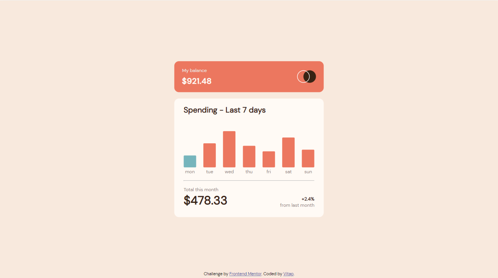
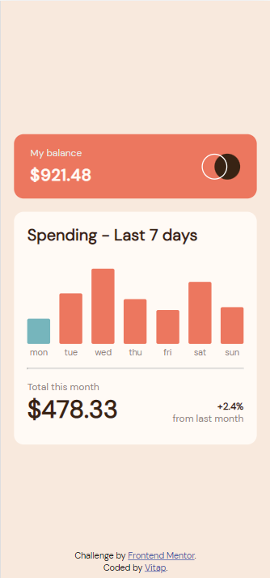

# Frontend Mentor - Expenses chart component solution

This is a solution to the [Expenses chart component challenge on Frontend Mentor](https://www.frontendmentor.io/challenges/expenses-chart-component-e7yJBUdjwt). Frontend Mentor challenges help you improve your coding skills by building realistic projects.

## Table of contents

- [Frontend Mentor - Expenses chart component solution](#frontend-mentor---expenses-chart-component-solution)
  - [Table of contents](#table-of-contents)
  - [Overview](#overview)
    - [The challenge](#the-challenge)
    - [Screenshot](#screenshot)
    - [Links](#links)
  - [My process](#my-process)
    - [Built with](#built-with)
    - [What I learned](#what-i-learned)
    - [Continued development](#continued-development)
    - [Useful resources](#useful-resources)
  - [Author](#author)

## Overview

### The challenge

Users should be able to:

- View the bar chart and hover over the individual bars to see the correct amounts for each day
- See the current day’s bar highlighted in a different colour to the other bars
- View the optimal layout for the content depending on their device’s screen size
- See hover states for all interactive elements on the page
- **Bonus**: Use the JSON data file provided to dynamically size the bars on the chart

### Screenshot

<figure align="center">
  
  <figcaption>
    <b>Fig.1 - Desktop Screenshot</b>
  </figcaption>
</figure>

<figure align="center">
  
  <figcaption>
    <b>Fig.2 - Mobile Screenshot</b>
  </figcaption>
</figure>

### Links

- Solution URL: [My solution](https://www.frontendmentor.io/solutions/expenses-chart-component-TJ1MqdHTaF)
- Live Site URL: [expenses-chart-component-main](https://expenses-chart-component-main-xfj8.vercel.app/)

## My process

### Built with

- Semantic HTML5 markup
- CSS custom properties
- Flexbox
- Sass

### What I learned

- Responsible design

```css
.my-balance {
  width: max(30%, 400px);
}
```

- Center a div with `position: absolute;`

```css
.attribution {
  position: absolute;
  bottom: 0;
  left: 50%;
  transform: translate(-50%, -20%);
}
```

- Function in CSS

```css
.bar {
  height: calc(var(--amount) \* 2px);
}
```

- Import json data into js file

1. In HTML

```html
<script type="module" src="index.js" async></script>
```

2. In js file

```js
import data from "./data.json" assert { type: "json" };
```

- Some DOM attributes and methods

```js
someElement.setAttribute("style", `--amount: ${data[number].amount}`);
```

```js
someElement.insertAdjacentHTML(
  "beforebegin",
  `<div class="amount">${something}</div>`
);
```

```js
someElement.previousSibling.remove();
```

### Continued development

- Make it more smooth when page refreshes after data loaded.

### Useful resources

- [3 modern CSS techniques for responsive design](https://www.youtube.com/watch?v=VsNAuGkCpQU) - I applied the first one in this solution.
- [use variable in style](https://svelte.dev/repl/f1c175281a494031a63b966fb8433bce?version=3.46.4) - demo of `calc( var(--size) * 1px );`.
- [How to import a JSON file in JavaScript (ES6 Modules)](https://bobbyhadz.com/blog/javascript-import-json-file)
- [How to center a "position: absolute" element](https://stackoverflow.com/a/25776315)
- [How to insert HTML before element in JavaScript without jQuery](https://stackoverflow.com/a/19316351) - Vanilla JS is great!
- [How to use HSL and calc functions in CSS to build darken and light colors](https://dev.to/danywalls/how-to-use-hsl-and-calc-functions-in-css-for-creating-darken-and-light-colors-3kbn) - This helps me know about changing the `L` value in `HSL` is the key to generate lighter or darker color with existed hsl one.
- [attr() in MDN](https://developer.mozilla.org/en-US/docs/Web/CSS/attr) - Helps me learn about attr(), though sadly can't apply in Sass.

## Author

- Github - [Vitap](https://github.com/Vitap7)
- Frontend Mentor - [@Vitap7](https://www.frontendmentor.io/profile/Vitap7)
